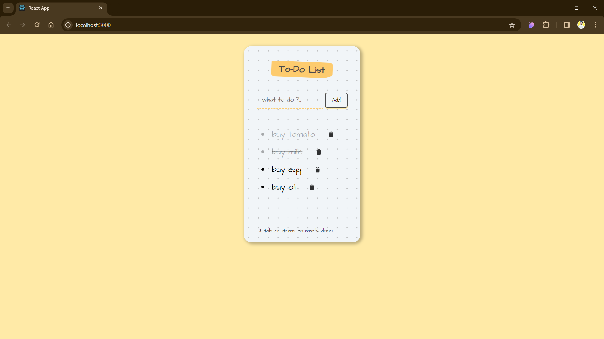

# To-Do List Web Application

Welcome to the To-Do List Web Application! This is a simple yet powerful tool for managing your tasks efficiently. With this application, you can easily add, track, and complete your to-do items, helping you stay organized and productive.


## Table of Contents

- [Features](#features)
- [Demo](#demo)
- [Screenshots](#screenshots)
- [Technologies Used](#technologies-used)
- [Getting Started](#getting-started)
  - [Installation](#installation)
  - [Prerequisites](#prerequisites)
- [Contributing](#clone-the-repository)
- [Contact](#contact)

## Features

- **Add New To-Do Items**: Easily add new tasks to your to-do list.
- **Mark as Done**: Toggle the completion status of to-do items by clicking on them.
- **Delete Items**: Remove unwanted tasks from your list with a simple click.
- **Responsive Design**: Enjoy a seamless experience across different devices and screen sizes.

## Demo

You can try out the live demo of the application [here](https://panchammmm.github.io/ToDoList-reactApp/).

## Screenshots



## Technologies Used

- **React**: A JavaScript library for building user interfaces.
- **HTML**: The standard markup language for creating web pages.
- **CSS**: A stylesheet language used for describing the presentation of a document written in HTML.

## Getting Started

To get a local copy of the project up and running on your machine, follow these steps:

## Installation

To run this project locally on your machine, follow these steps:

### Prerequisites

Before you begin, make sure you have the following installed on your system:

- [Node.js](https://nodejs.org/) (which includes npm, the Node.js package manager)

### Clone the Repository

1. Open your terminal.

2. Navigate to the directory where you want to store the project.

3. Clone the repository using the following command:

   ```bash
   git clone https://github.com/Panchammmm/ToDoList-reactApp.git my-app
   ```

### Install Dependencies

1. Navigate into the project directory:

   ```bash
   cd my-app
   ```

2. Install the required dependencies using npm:

   ```bash
   npm install
   ```

### Run the Application

Once you have installed the dependencies, you can run the application with the following command:

```bash
npm start
```

This will start a local development server and open the application in your default web browser.

### Access the Application

You can now access the application by navigating to the following URL in your web browser:

```
http://localhost:3000
```

## Contact

If you have any questions, suggestions, or feedback, feel free to reach out to me. You can contact me via:

- Email: your.email@example.com
- GitHub: [YourGitHubUsername](https://github.com/Panchammmm)
- LinkedIn: [YourLinkedInProfile](https://www.linkedin.com/in/pancham-sardar-6a466227b/)
